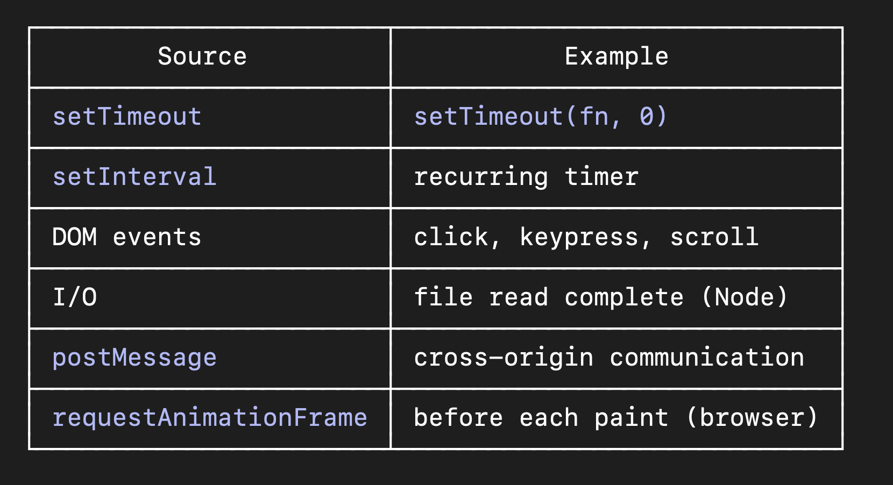
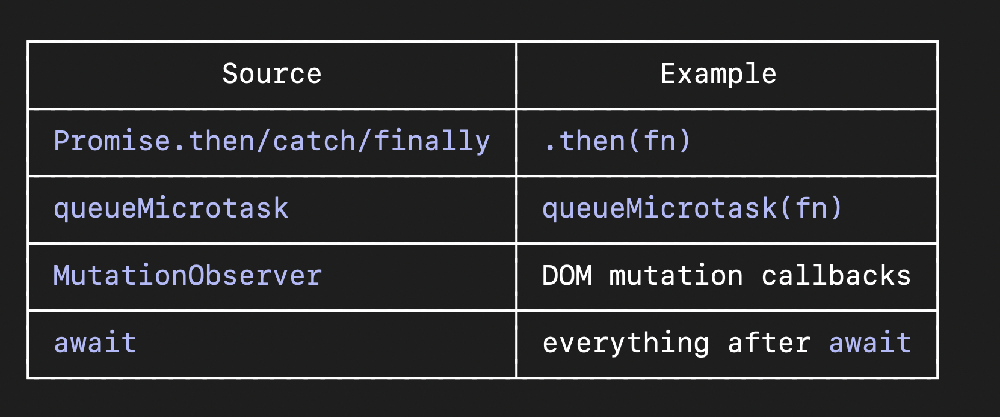

## Callback Queue

The callback queue is a FIFO queue that holds asynchronous callbacks from Web APIs, which the event loop transfers to the call stack one at a time, only after the call stack and microtask queue are both empty.

## Macrotask Queue

Also called the task queue. Callbacks land here:



One macrotask per event loop iteration. The event loop picks ONE callback, runs it to completion,
then checks microtasks before picking the next macrotask.

## Microtask Queue

Higher priority. Completely drained after every task — including after each macrotask and after the
initial script execution.



```
Critical rule: After every macrotask, ALL microtasks are drained before the next macrotask runs. Even if microtasks keep adding more microtasks — they all run before the next macrotask.
```

---

### requestAnimationFrame

`requestAnimationFrame` — where does it fit?

rAF sits between macrotasks and rendering:

macrotask → microtasks → rAF callbacks → render → next macrotask

This is why rAF is better than setTimeout for animations — it fires right before the browser paints,
giving you smooth 60fps updates.

// Bad for animation — fires whenever, may miss frame
setTimeout(() => moveElement(), 16);

// Good — fires right before each paint
requestAnimationFrame(() => moveElement());

---

### setTimeout

setTimeout(fn, 0) — what does 0 actually mean?

It doesn't mean "run immediately." It means "run as soon as possible after the current task and all
microtasks are done."

Minimum delay in browsers is actually 4ms due to spec requirements, even if you pass 0.

console.log('start');
setTimeout(() => console.log('timeout'), 0);
Promise.resolve().then(() => console.log('promise'));
console.log('end');

// start
// end
// promise ← microtask, runs before timeout
// timeout ← macrotask, runs last

###
